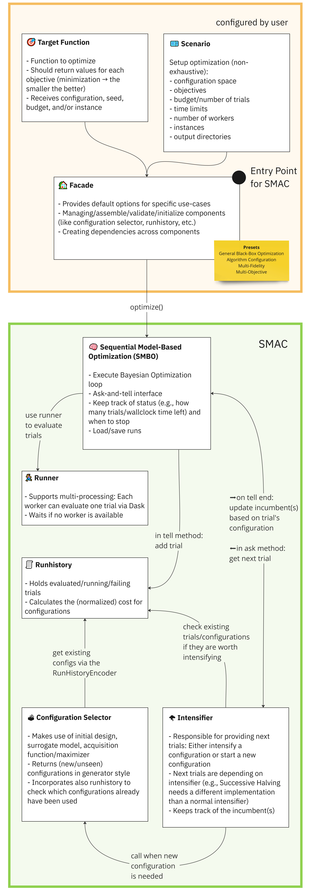

[](){#getting_started}
# Getting Started

SMAC needs four core components (configuration space, target function, scenario and a facade) to run an
optimization process, all of which are explained on this page.

They interact in the following way:

<figure markdown="span">
  { width="300" }
  <figcaption>Interaction of SMAC's components</figcaption>
</figure>


## Configuration Space

The configuration space defines the search space of the hyperparameters and, therefore, the tunable parameters' legal
ranges and default values.

```python
from ConfigSpace import ConfigSpace

cs = ConfigurationSpace({
    "myfloat": (0.1, 1.5),                # Uniform Float
    "myint": (2, 10),                     # Uniform Integer
    "species": ["mouse", "cat", "dog"],   # Categorical
})
```

Please see the documentation of `ConfigSpace <https://automl.github.io/ConfigSpace/latest/>`_ for more details.


## Target Function

The target function takes a configuration from the configuration space and returns a performance value.
For example, you could use a Neural Network to predict on your data and get some validation performance.
If, for instance, you would tune the learning rate of the Network's optimizer, every learning rate will
change the final validation performance of the network. This is the target function.
SMAC tries to find the best performing learning rate by trying different values and evaluating the target function -
in an efficient way.

```python
    def train(self, config: Configuration, seed: int) -> float:
        model = MultiLayerPerceptron(learning_rate=config["learning_rate"])
        model.fit(...)
        accuracy = model.validate(...)

        return 1 - accuracy  # SMAC always minimizes (the smaller the better)
```

!!! warning
    SMAC *always* minimizes the value returned from the target function.


!!! note
    In general, the arguments of the target function depend on the intensifier. However,
    in all cases, the first argument must be the configuration (arbitrary argument name is possible here) and a seed.
    If you specified instances in the scenario, SMAC requires ``instance`` as argument additionally. If you use
    ``SuccessiveHalving`` or ``Hyperband`` as intensifier but you did not specify instances, SMAC passes `budget` as
    argument to the target function. But don't worry: SMAC will tell you if something is missing or if something is not
    used.


!!! warning
    SMAC passes either `instance` or `budget` to the target function but never both.


## Scenario

The [Scenario][smac.scenario] is used to provide environment variables. For example, 
if you want to limit the optimization process by a time limit or want to specify where to save the results.

```python
from smac import Scenario

scenario = Scenario(
    configspace=cs,
    output_directory=Path("your_output_directory")
    walltime_limit=120,  # Limit to two minutes
    n_trials=500,  # Evaluated max 500 trials
    n_workers=8,  # Use eight workers
    ...
)
```


## Facade

A [facade][smac.facade.abstract_facade] is the entry point to SMAC, which constructs a default optimization 
pipeline for you. SMAC offers various facades, which satisfy many common use cases and are crucial to
achieving peak performance. The idea behind the facades is to provide a simple interface to all of SMAC's components,
which is easy to use and understand and without the need of deep diving into the material. However, experts are
invited to change the components to their specific hyperparameter optimization needs. The following
table (horizontally scrollable) shows you what is supported and reveals the default [components][components]:

| | [Black-Box][smac.facade.blackbox_facade] | [Hyperparameter Optimization][smac.facade.hyperparameter_optimization_facade] | [Multi-Fidelity][smac.facade.multi_fidelity_facade] | [Algorithm Configuration][smac.facade.algorithm_configuration_facade] | [Random][smac.facade.random_facade] | [Hyperband][smac.facade.hyperband_facade] |
| --- | --- | --- | --- | --- | --- | --- |
| #Parameters | low | low/medium/high | low/medium/high | low/medium/high | low/medium/high | low/medium/high |
| Supports Instances | ❌ | ✅ | ✅ | ✅ | ❌ | ✅ |
| Supports Multi-Fidelity | ❌ | ❌ | ✅ | ✅ | ❌ | ✅ |
| Initial Design | [Sobol][smac.initial_design.sobol_design] | [Sobol][smac.initial_design.sobol_design] | [Random][smac.initial_design.random_design] | [Default][smac.initial_design.default_design] | [Default][smac.initial_design.default_design] | [Default][smac.initial_design.default_design] |
| Surrogate Model | [Gaussian Process][smac.model.gaussian_process.gaussian_process] | [Random Forest][smac.model.random_forest.random_forest] | [Random Forest][smac.model.random_forest.random_forest] | [Random Forest][smac.model.random_forest.random_forest] | Not used | Not used |
| Acquisition Function | [Expected Improvement][smac.acquisition.function.expected_improvement] | [Log Expected Improvement][smac.acquisition.function.expected_improvement] | [Log Expected Improvement][smac.acquisition.function.expected_improvement] | [Expected Improvement][smac.acquisition.function.expected_improvement] | Not used | Not used |
| Acquisition Maximizer | [Local and Sorted Random Search][smac.acquisition.maximizer.local_and_random_search] | [Local and Sorted Random Search][smac.acquisition.maximizer.local_and_random_search] | [Local and Sorted Random Search][smac.acquisition.maximizer.local_and_random_search] | [Local and Sorted Random Search][smac.acquisition.maximizer.local_and_random_search] | [Local and Sorted Random Search][smac.acquisition.maximizer.random_search] | [Local and Sorted Random Search][smac.acquisition.maximizer.random_search] |
| Intensifier | [Default][smac.intensifier.intensifier] | [Default][smac.intensifier.intensifier] | [Hyperband][smac.intensifier.hyperband] | [Default][smac.intensifier.intensifier] | [Default][smac.intensifier.intensifier] | [Hyperband][smac.intensifier.hyperband] |
| Runhistory Encoder | [Default][smac.runhistory.encoder.encoder] | [Log][smac.runhistory.encoder.log_encoder] | [Log][smac.runhistory.encoder.log_encoder] | [Default][smac.runhistory.encoder.encoder] | [Default][smac.runhistory.encoder.encoder] | [Default][smac.runhistory.encoder.encoder] |
| Random Design Probability | 8.5% | 20% | 20% | 50% | Not used | Not used |


!!! info
    The multi-fidelity facade is the closest implementation to [BOHB](https://github.com/automl/HpBandSter).


!!! note
    We want to emphasize that SMAC is a highly modular optimization framework.
    The facade accepts many arguments to specify components of the pipeline. Please also note, that in contrast
    to previous versions, instantiated objects are passed instead of *kwargs*.


The facades can be imported directly from the ``smac`` module.

```python
from smac import BlackBoxFacade as BBFacade
from smac import HyperparameterOptimizationFacade as HPOFacade
from smac import MultiFidelityFacade as MFFacade
from smac import AlgorithmConfigurationFacade as ACFacade
from smac import RandomFacade as RFacade
from smac import HyperbandFacade as HBFacade

smac = HPOFacade(scenario=scenario, target_function=train)
smac = MFFacade(scenario=scenario, target_function=train)
smac = ACFacade(scenario=scenario, target_function=train)
smac = RFacade(scenario=scenario, target_function=train)
smac = HBFacade(scenario=scenario, target_function=train)
```