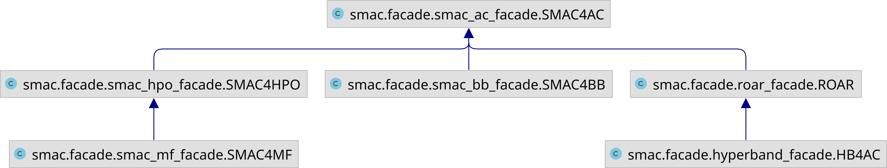

Facades
-------

SMAC of course itself offers a lot of design choices, some of which are crucial to achieve peak performance.
Luckily, often it is sufficient to distinguish between a few problem classes.
To make the usage of SMAC as easy as possible, we provide several facades designed for these different use cases.
Here we give some general recommendations on when to use which facade.
These recommendations are based on our experience and technical limitations and is by far not intended to be complete:

.. csv-table::
    :header: "", "SMAC4BB", "SMAC4HPO", "SMAC4MF", "SMAC4AC"
    :widths: 15, 10, 10, 10, 10

    "# parameter", "low", "low/medium/high", "low/medium/high", "low/medium/high"
    "Categorical hyperparameters", "Supported", "Supported", "Supported", "Supported"
    "Conditional hyperparameters", "Supported", "Supported", "Supported", "Supported"
    "Instances", "No", "None or :term:`CV`", "None or :term:`CV`", "Yes"
    "Stochasticity",  "No", "Supported", "Supported", "Supported"
    "Objective", "Any (except runtime)", "e.g. validation loss",  "e.g. validation loss", "Any"
    "Multi-Fidelity", "No", "No", "Yes", "Yes"
    "Search Strategy", ":term:`Gaussian Process<GP>` or :term:`GP-MCMC`", ":term:`Random Forest<RF>`", ":term:`Random
    Forest<RF>`", ":term:`Random Forest<RF>`, :term:`Gaussian Process<GP>`, :term:`GP-MCMC` or Random"

.. note::

    The ``SMAC4MF`` facade is the closest implementation to
    `BOHB <https://github.com/automl/HpBandSter>`_.

Inheritance
~~~~~~~~~~~

Here we show the class inheritance of the different facades.
Because SMAC4AC is the facade every other facade is inherited from, we recommend using SMAC4AC if a lot of flexibility is needed. 

    Class inheritance of the SMAC facades.

