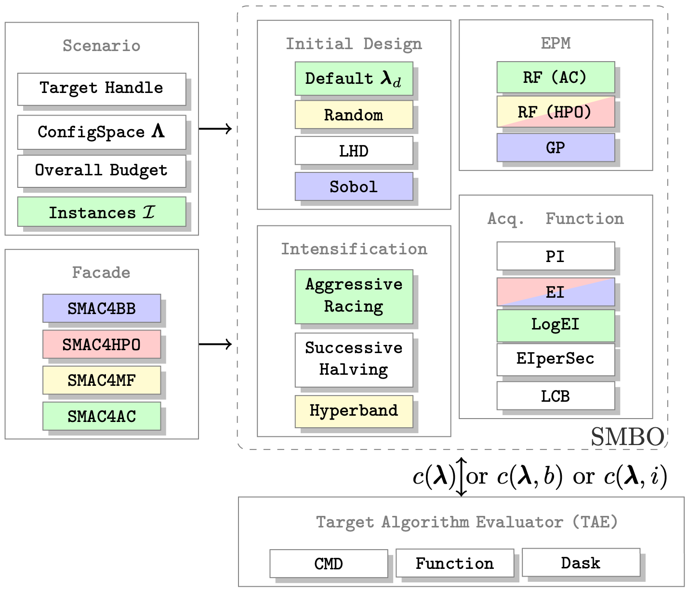

Package Overview 
================

SMAC supports you in determining well-performing hyperparameter configurations for your algorithms.
By being a robust and flexible framework for :term:`BO`, SMAC can improve performance within few function evaluations.
It offers several :ref:`Facades` and pre-sets for typical use cases, such as optimizing
hyperparameters, solving low dimensional continuous (artificial) global optimization problems and configuring algorithms to perform well across multiple problem :ref:`Instances<Instances and Features>`.

.. note::

    Attention: This package is a reimplementation of the original SMAC tool.
    However, the reimplementation slightly differs from the original SMAC.
    For comparisons against the original SMAC, we refer to a stable release of SMAC (v2) in Java
    which can be found `here <http://www.cs.ubc.ca/labs/beta/Projects/SMAC/>`_.

Features
~~~~~~~~~

SMAC has following characteristics and capabilities:

Global optimizer
    :term:`Bayesian Optimization<BO>` is used for sample-efficient optimization.

Optimize :term:`Black-Box<BB>` functions
    Optimization is only aware of input and output. It is agnostic to internals of the function.

Flexible hyperparameters
    Use categorical, continuous or hierarchical hyperparameters. SMAC can optimize up to 100
    hyperparameters efficiently.

Any objectives
    Optimization with any :term:`objective<Objective>` (e.g., quality or runtime) is possible.

:term:`Multi-Fidelity<MF>` Optimization
    Judge configurations on multiple :term:`budgets<Budget>` to discard unsuitable configurations
    early on. This will result in a massive speed-up, depending on the budgets.
    
:ref:`Instances<Instances and Features>`
    Find well-performing hyperparameter configurations not only for one instance (e.g. dataset) of
    an algorithm, but for many.
    
Commandline
    SMAC can not only be executed within a python file but also from the commandline. Consequently,
    not only algorithms in python can be optimized but in other languages as well.

Components
~~~~~~~~~~

Surrogate Models
    - Gaussian Process
    - Random Forest (with instances and without)

Acquisition Functions
    - Probability of Improvement (PI)
    - Expected Improvement (EI)
    - Lower Confidence Bound (LCB)

Intensification
    - Aggressive Racing
    - Successive Halving
    - Hyperband

Please see the following figure for a more detailed overview:

